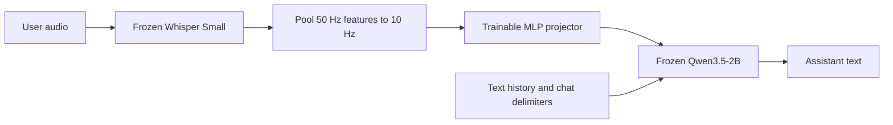
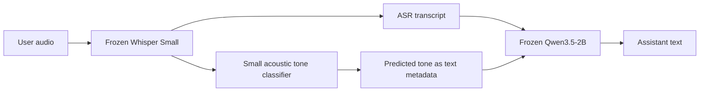

# Speech projection into a frozen language model

Can a small trainable projector turn frozen speech-encoder features into inputs
that a frozen text LLM understands? This project tests that with **Whisper Small
and Qwen3.5-2B**, including paired emotional speech and multi-turn conversations.

**In these synthetic tests, speech projection makes replies more emotionally
sensitive than plain ASR, but loses factual grounding. We did not demonstrate an
advantage over ASR plus predicted tone.** Acoustic information survives the
projector; preserving reliable conversational content remains the bottleneck.
ASR with optional acoustic tone information is the more promising practical path
from this experiment. These small experiments do not establish which architecture
is best in general.

## How it works



Projected audio vectors enter Qwen through `inputs_embeds` in the current user
message. They **do not replace its vocabulary embedding table**. Text history and
delimiters use the original embeddings; the current transcript is absent from the
speech path. Only the **2.89 million parameter** projector is trained. Gradients
pass through Qwen, whose weights remain frozen.

Training targets are Qwen's own replies to the true transcript and history.
Emotional targets additionally use intended-delivery metadata; the projector
receives only the corresponding audio. Frozen Whisper features are cached once.

## Main results

The selected model uses **10 speech tokens/second and 6,775 optimizer updates**.
Training has 38,193 examples. Validation selection uses 128 examples; the main
test scores 256 examples and generates 136 replies. Whole dialogues or synthetic
design families stay within one split.

| System | Ordinary response CE ↓ | Emotional response CE ↓, older / Neu | Pooled CE ↓ |
|---|---:|---:|---:|
| Previous 2.5 Hz projector, 4,775 updates | 1.63 | 0.852 / 0.742 | 1.5 |
| 10 Hz projector, 4,775 updates | 1.62 | 0.828 / 0.735 | 1.48 |
| **Selected 10 Hz projector, 6,775 updates** | **1.61** | **0.764 / 0.646** | **1.46** |
| True transcript → Qwen | 1.56 | 0.737 / 0.739 | 1.42 |
| Whisper ASR → Qwen | 1.57 | 0.777 / 0.77 | 1.44 |

CE measures imitation of saved teacher responses, **not answer accuracy**. The
teacher saw tone metadata for emotional targets, while the transcript and plain
ASR baselines did not. Lower emotional loss therefore cannot establish overall
superiority. The two 4,775-update checkpoints give the equal-budget compression
comparison; the selected checkpoint also received more training.


The emotional plot uses the same 64 reply IDs for every system. The projector
has slightly lower teacher loss than ASR plus tone (**0.656 versus 0.687**), but
lower reference similarity (**0.706 versus 0.908**). These measures disagree;
neither is a direct measure of correctness or emotional appropriateness.

- **Ordinary grounding:** review of 48 speech/ASR response pairs preferred ASR in
  12, speech in two, tied 32, and left two ambiguous.
- **Acoustic conditioning:** the selected projector preferred matching over
  swapped emotional audio/target assignments in 35 of 40 same-text pairs
  (**87.5%, confidence interval approximately 74–98%**). A length-controlled
  ablation retained the benefit. This is not natural emotion-recognition accuracy.
- **Longer training:** one complete pass is 4,775 updates at effective batch eight.
  Continuing to 9,550 lowered loss, but introduced three new material validation
  errors versus one correction. We retained 6,775. Convergence was not established.
- **Other objectives:** a transcript-reconstruction mixture did not beat response
  training; teacher-distribution KL failed the ordinary-loss selection safeguard.

### Emotional response quality

Reviewers scored tone helpfulness and factual grounding separately on **0–2
rubrics**. Differences below are rubric points, not percentages. Intervals are
95% family-bootstrap intervals; reviewers were models, not a human listening
panel.

| Comparison against plain ASR | Replies | Tone difference | Grounding difference | Tone wins / ties / losses |
|---|---:|---:|---:|---:|
| Selected speech projector | 88 | +0.25 [0.128, 0.36] | −0.284 [−0.609, 0.054] | 28 / 53 / 7 |
| ASR + predicted tone | 64 | +0.219 [0.061, 0.382] | −0.094 [−0.346, 0.171] | 20 / 38 / 6 |

Both show a synthetic tone benefit. Grounding preservation remains unproven, and
an independent reviewer on a smaller shared panel was less certain. The panels
differ, so these rows do not rank the two systems directly. The tone classifier
was tested on one synthetic voice and four intended deliveries; its perfect
synthetic test score does not make it a general emotion detector.


On the Neu-only panel, the projector's estimated tone gain is **+0.312** versus
**+0.219** for ASR plus tone. Both comparisons contain 64 replies, but were judged
separately against plain ASR. That nominal gap is **not a demonstrated
head-to-head improvement**. The smaller second-reviewer audit was also uncertain.

### Separate acoustic tone classifier

We also trained a **small CPU logistic-regression classifier on frozen Whisper
features**, independently of the speech projector. It predicts happy, sad, angry
or fearful delivery from audio features alone: encoder-state means, standard
deviations and four temporal-bin means. It receives no transcript or intended
tone label as input. Scaling and fitting use only the training split, with fixed
hyperparameters and no held-out tuning.

| Split | Correct clips | Balanced accuracy | Macro F1 | Pairs with both deliveries correct |
|---|---:|---:|---:|---:|
| Train | 9,100 / 9,100 | 100% | 1 | 4,550 / 4,550 |
| Validation | 459 / 460 | 99.6% | 0.997 | 229 / 230 |
| Test | **440 / 440** | **100%** | **1** | **220 / 220** |

The only validation error classified an intended fearful clip as sad. Test
examples come from 22 held-out design families; literal texts and source paths
were checked for overlap across splits. Fitting took **3.72 seconds on CPU**;
feature loading, hashing and fitting together took **22.7 seconds**, excluding
interpreter startup and separate preparation.



This establishes that **the frozen speech features contain easily separable
synthetic delivery information**. It also supplies the tone cues used in the
ASR-plus-tone comparison above: predictions were correct on all 64 emotional
response examples, so predicted and reference-tone prompts coincide there.
Classification accuracy and response quality answer different questions; perfect
labels did not yield perfect grounding or multi-turn behavior.

These clips use one synthetic voice and four intended labels. A classifier may
recognize synthesis signatures as well as expressive prosody. There is no neutral
or unknown class, human perceptual validation, or natural-speaker evaluation.
The result supports further testing of ASR plus acoustic cues, rather than a claim
of 100% real-world emotion recognition. See the
[classifier evidence](results/followup_20261007/provenance/tone_classifier/summary.md).

### Multi-turn behavior

**The projection supports multi-turn inference mechanically:** the model
generated replies throughout four-turn conversations, and every saved evaluated
reply reached its end marker. Each turn rebuilds the prompt with the current
audio and prior history. Qwen's normal text weights remain frozen, so training
has not altered its text-only parameters. These tests do not validate streaming
prefill or a persistent cross-request KV cache.

**Conversational quality is a separate result.** Three situations, each with two
initial emotional deliveries, produce six diagnostic branches. Later neutral
turns ask for brevity, a concrete situation-specific next step, then an explicit
end. We test fixed assistant history, retained prior audio, previous text history,
and four-turn rollouts using each pipeline's own replies. Retained-audio history
was not trained; the current-audio/text-history control is closer to training.

| Pipeline / history format | Useful next step | Explicit closure |
|---|---:|---:|
| Selected projector, fixed retained-audio history | 0 / 6 | 0 / 6 |
| Selected projector, fixed previous text history | 0 / 6 | **4 / 6** |
| Selected projector, own-history rollout | 0 / 6 | 0 / 6 clear; one borderline |
| Plain ASR, fixed history | 2 / 6 | 6 / 6 |
| Plain ASR, own-history rollout | 4 / 6 | 4 / 6 |
| ASR + initial predicted tone, fixed history | 4 / 6 | 6 / 6 |
| ASR + initial predicted tone, own-history rollout | 4 / 6 | 3 / 6 |

For example, after discussing an already-shared draft, the speech rollout says
“I'm here to help you find the next step” without naming an action. Plain ASR
instead suggests waiting for colleagues' feedback. Previous text history helps
the projector accept closure for the draft and cafe scenarios, but it still
misses their concrete next-step requests. Thus the weakness extends beyond
remembering emotion: it includes ordinary content and instruction following.

Useful later reuse of the initial acoustic emotion was not demonstrated.
However, **we did not measure how much quality declines per additional turn**,
so this panel cannot establish that multi-turn quality stays close to single-turn
quality, or that it degrades by a particular amount. It demonstrates working
conversation assembly with limited conversational reliability. The counts are
model-assisted qualitative diagnostics from only three independent situations,
not a broad dialogue accuracy benchmark. Read the
[multi-turn audit](results/followup_20261007/analysis/final_selected_conversation_review.md)
for all history controls and the [saved replies](results/followup_20261007/analysis/final_conversation_all168_compact.md).

## Data and reusable generation pipeline

The mixed training set contains 19,999 DeepDialogue-derived ordinary examples,
9,094 older Qwen emotional examples, and 9,100 Neu emotional examples. The two
complete emotional source collections each contain **5,000 unique utterances,
two deliveries each, and tone-conditioned teacher replies**. Their original
audio is preserved; split and filtering details are in the full report.

The generation pipeline uses diverse everyday situations, identical words across
each pair, only plausible contrasting deliveries, and resumable text/audio
generation with hash and completion checks. Intended emotions are synthetic
control labels, not human-verified perceptual annotations.

See [dataset generation and release](docs/dataset_release.md) for the scripts,
export format, limitations and source terms.
The emotional collections should be released separately from the
DeepDialogue-derived data. Both complete collections are public on Hugging Face:
[Neu paired emotional speech](https://huggingface.co/datasets/BertilBraun/neu-paired-emotional-speech)
and [Qwen paired emotional speech](https://huggingface.co/datasets/BertilBraun/qwen-paired-emotional-speech).

## Reproduction and documentation

The reference implementation uses PyTorch/Transformers on one RTX 3090, BF16,
microbatch one, gradient accumulation eight, and activation checkpointing.
The follow-up took **5.55 hours** including evaluation and reporting; its new
training loops took **3.78 hours**. Cached features occupy **20.8 GB**. Observed
NVIDIA process memory reached **23.8 GB**, a sampled observation rather than a
measured peak. The selected projector checkpoint is **11.6 MB**.

```powershell
uv sync
uv run ruff format
uv run ruff check --fix
uv run pytest -m "not integration"
```

- [Full experiment report](docs/experiment_report.md): training decisions,
  uncertainty, qualitative examples, plots and resource accounting.
- [Results index](results/followup_20261007/README.md): saved measurements,
  complete response reviews and selection receipts.
- [Model and scheduler interface](docs/rust_scheduler_model_handoff.md): audio,
  exact chat delimiters, prefill and cache handling.
- [Dataset generation and release](docs/dataset_release.md).
- [Manual publication guide](docs/publication.md).

Measurements in documentation use three significant digits. Exact counts,
configuration values, token IDs, hashes and original machine-readable evidence
are retained for reproduction. Earlier V0–V3 experiments used different
supervision and remain historical; the teacher-supervised results above are the
current findings. No LoRA or speech-encoder fine-tuning was performed.

Both complete emotional collections preserve their original audio and teacher
targets. All public release file hashes were verified at pinned Hub revisions;
each dataset contains 10,000 examples. Dataset-viewer indexing is asynchronous;
see the [publication receipt](docs/publication.md) for its checked status.
Validation passed: **618 tests**, Ruff formatting/lint, local links and dataset
cards. The README plots can be regenerated from the locked reports:

```powershell
uv run python -m scripts.plot_readme_results --analysis .\results\followup_20261007\analysis --output .\docs\figures
```
