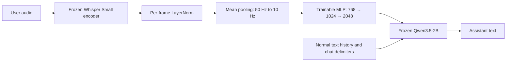
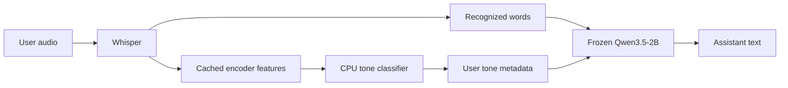
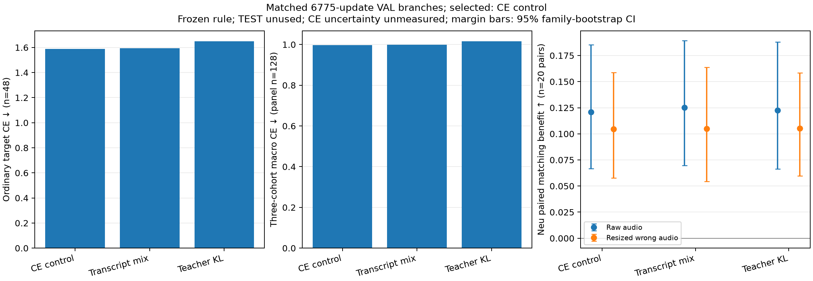
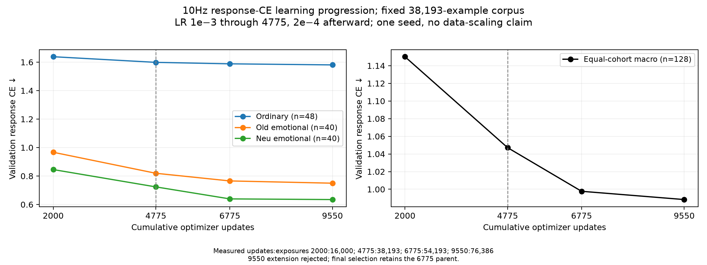
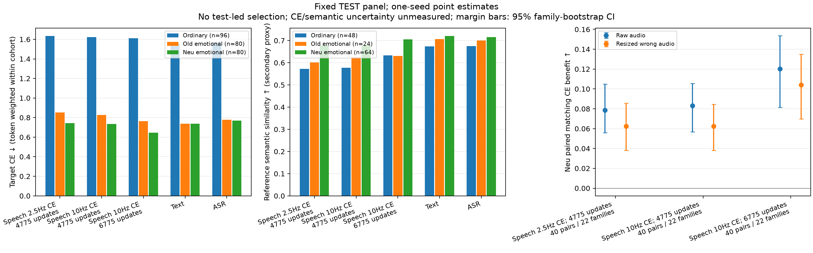
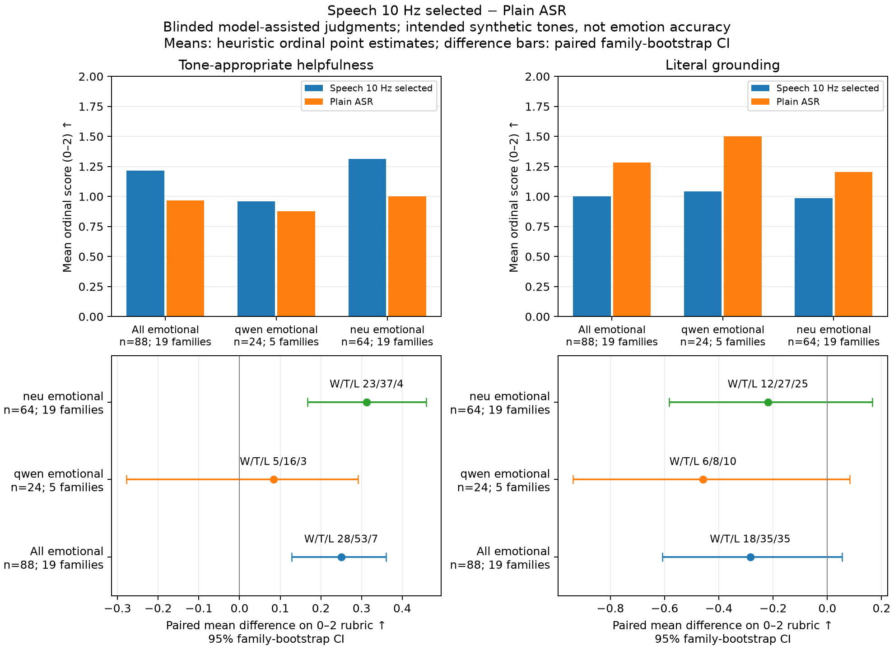

# Speech projection into a frozen Qwen language model

This repository studies whether frozen Whisper Small speech features can replace the current user's text embeddings at the input of frozen Qwen3.5-2B. It also compares a simpler alternative: Whisper transcription plus an acoustic tone classifier.

Only the small projector is trained in the speech path. Qwen's vocabulary embedding table, transformer parameters and output head remain unchanged. Normal text history and chat delimiters use Qwen's original token embeddings; projected audio occupies the current user message between those delimiters. The audio is never converted to vocabulary IDs or supplied alongside its transcript at inference.

## Latest experiment: 7 October 2026

**The full 10 Hz run completed, along with three matched training objectives, an
additional second pass, held-out generation, emotional review and multi-turn
evaluation. The selected checkpoint is response-CE at 6,775 updates.**

The projector responds differently to same-word emotional deliveries, and the
blinded model-assisted review finds a synthetic tone benefit over plain ASR.
Grounding remains a weakness: better emotional phrasing sometimes accompanies
changed facts. The practical alternative, ASR plus a small acoustic classifier,
also improves tone on the synthetic panel while keeping recognized words as input.
Neither result establishes natural-speaker emotion accuracy or grounding
noninferiority. Multi-turn speech generates fluent replies, but does not reliably
honor requests for concrete actions; the closer-to-training text-history format
does recover some explicit conversation endings.

| Question | Measured finding |
|---|---|
| Does 10 Hz improve teacher-response alignment? | Yes, compared with the previous 2.5 Hz full pass; see matched held-out losses below. |
| Does the projected audio influence emotion? | Selected speech beats plain ASR on tone in 28/88 replies, ties 53, loses 7; ordinal mean difference +0.250. |
| Is it better grounded? | No established improvement: grounding wins/ties/losses 18/35/35; mean difference −0.284, with substantial uncertainty. |
| Can ASR plus acoustic tone help? | Tone wins/ties/losses 20/38/6 on 64 Neu replies; mean +0.219. Grounding noninferiority remains unproven. |
| Does multi-turn speech work reliably? | It produces replies, but 0/6 useful next-step responses in each tested history arm. Text-history closure improves to 4/6. |
| Do auxiliary lexical objectives win? | The 30% transcript mixture does not win the fixed selection; ordinary KL fails the ordinary-loss safeguard. |
| Should training simply continue longer? | A second pass lowers loss but introduces material validation errors and is rejected by the predeclared quality veto. |

These small, one-seed diagnostics support an acoustic signal, not a production
replacement for ASR. For a grounded prototype, the strongest next experiment is
ASR plus independently validated tone information, with neutral/unknown handling.

## Pipeline





## Data and supervision

The current mixed dataset has 38,193 training, 1,432 validation and 1,392 test examples. Training comprises 19,999 ordinary conversational examples, 9,094 older Qwen emotional examples and 9,100 new Neu emotional examples. Existing audio and teacher targets are preserved. One ordinary training dialogue/example with normalized held-out prompt overlap and three overlong older emotional pairs (six clips) were omitted from the mixed manifest; the original files were retained.

| Training cohort | Examples | Mean audio seconds | Mean teacher reply words | Previous text history |
|---|---:|---:|---:|---|
| Ordinary conversation | 19,999 | 7.19 | 143.5 | Zero or two turns |
| Older Qwen emotional | 9,094 | 6.51 | 19.8 | None |
| Neu emotional | 9,100 | 5.31 | 23.0 | None |

The assistant targets are Qwen's own previously generated replies, rather than the original DeepDialogue assistant turns. Ordinary teacher input uses the true user transcript and history. Emotional teacher input additionally has intended-tone metadata; the speech projector must infer its useful information from the audio. The emotional targets are concise; many ordinary targets are longer. This difference is why we report both token-weighted loss and equally weighted cohort loss. Ordinary targets contribute 20,883 of the main test's 25,007 tokens (83.5%); the macro instead weights each cohort equally. Lower emotional loss does not by itself mean emotional understanding is easier or more accurate.

Ordinary examples had already passed audio/text alignment filtering before this follow-up: the 30,000-example training candidate pool contained 562 material alignment flags and 62 lexical substitutions; 20,000 examples were selected. Validation and test construction excluded 692 and 642 whole collision dialogues respectively. These are candidate-pool counts, can overlap, and are not counts to subtract from the final manifest. The reference transcript is the documented `audio_cleaned_text` used for synthesis, rather than an independent transcription of the recorded waveform.

Splits keep whole dialogue IDs or explicit synthetic design families together. The synthetic paired sets use the same literal words in two deliveries. Evaluation on these sets establishes behavior on synthetic audio, not on arbitrary natural speakers.

Frozen Whisper Small produces final normalized encoder states of dimension 768 at approximately 50 Hz. BF16 cached states occupy about 76,800 bytes per audio second before file overhead. The cache retains uncompressed states and sequence lengths, so projector runs reuse the same speech representation. The 10 Hz interface pools five adjacent states; its MLP has 2,888,192 trainable parameters and outputs Qwen's 2,048-dimensional input embeddings.

| Component | Parameters | Updated? |
|---|---:|---|
| Qwen text backbone, including tied embedding/output table | 1,881,825,088 | No |
| Vocabulary embedding table, included in the backbone above | 508,559,360 | No |
| Speech MLP projector with LayerNorm | 2,888,192 | Yes |

The vocabulary table is 248,320 × 2,048. Projected speech vectors bypass lookup for the audio positions; they do not replace the table. Ordinary text-only inference therefore retains the original model weights and computation. Audio-conditioned conversation can still be worse because imperfect speech vectors change the input. The frozen-weight gradient checks establish that training did not modify text weights; they are not a separate broad text-capability benchmark.

Normal text tokens are integer IDs looked up in that table. Speech supplies continuous vectors directly to `inputs_embeds`, between the normal user and assistant delimiters. There is no conversion to one-hot vocabulary tokens:

```text
original text embeddings: system + history + <|im_start|>user\n
projected audio vectors:  z₁, z₂, …, zₘ  (each has width 2,048)
original text embeddings: <|im_end|>\n<|im_start|>assistant\n<think>\n\n</think>\n\n
generated assistant tokens, stopping at <|im_end|> (ID 248046)
```

Loss applies only to the assistant target, including its end marker. Gradients propagate through frozen Qwen computation to the speech vectors and projector; the optimizer contains projector parameters only. Padding, previous history and speech slots are excluded from target loss.

**Prompt policy is part of the interface.** The mixed examples override the
run's default chat prompt: ordinary examples have no system message; older
emotional examples use this generic system text:

```text
Reply naturally in one or two short sentences. The supplied tone describes the user's emotional delivery. Respond appropriately to that delivery and what they said.
```

Neu emotional examples use:

```text
Respond naturally in one or two concise sentences. Use the user's delivery to interpret their words. A happy delivery calls for warmth; sad for gentle support; angry for calm acknowledgment without cheering; fearful for reassurance without dismissing uncertainty. Stay specific to what they said. Do not name the tone or invent events.
```

These generic policies enumerate possible deliveries but do not supply the
current clip's tone label to speech or plain ASR. Only the separate tone-aware
baseline adds its predicted label. Reproducing the emotional results with
chat-only prompting would change the experiment. Current held-out generation is
greedy with a 256-new-token cap, not the older prototype's sampling settings.

## What the training comparisons change

The full 10 Hz response-CE checkpoint completes one pass over all 38,193 training examples, at 4,775 optimizer updates with effective batch eight. It resumes the original 2,000-update 10 Hz checkpoint rather than repeating completed work.

Three controlled branches start from that exact checkpoint and AdamW state. Each adds 2,000 updates with learning rate 0.0002, the same seed and the same example order:

- **Response CE control:** continue learning the original assistant targets.
- **Transcript mixture:** on a deterministic 30% of examples, train the audio input to produce its existing transcript under a transcription instruction, clearing previous history for that task. Other examples retain assistant-response CE with their original history. This is an additional training objective, not an ASR transcript supplied to the conversational model at inference.
- **Ordinary response KL:** for ordinary examples, match the frozen Qwen probability distribution produced with the true transcript, under the same teacher response prefix. Emotional examples retain their original response CE. This supplies a richer lexical alignment signal than one target token at each position.

Transcript-task answers are shorter, so equal updates do not imply equal target-token exposure. Response CE and KL values are also different objectives. Selection therefore uses assistant-response validation CE and paired controls, rather than comparing raw training losses across objectives.

The validation selection policy was fixed before branch results. It keeps auxiliary branches only if ordinary CE is no more than 0.05 above the response-only control and the smaller of raw/resized Neu matching margins is no more than 0.02 below control. Within 0.03 of the eligible best macro CE, it chooses lower ordinary CE. These are practical safeguards, not statistically calibrated thresholds. Fixed validation output review can veto clear content regressions; test outputs do not choose the checkpoint.

The qualitative veto requires **at least three new material failures and more
new failures than clear corrections**, after reading all 24 fixed validation
cases. Its counts and reasons remain reviewable.

| Matched branch, 6,775 cumulative updates | Ordinary validation CE | Three-cohort macro CE | Robust Neu paired margin | Validation decision |
|---|---:|---:|---:|---|
| Response CE control | 1.588295 | 0.997702 | +0.104584 | Selected |
| 30% transcript mixture | 1.593912 | 0.998907 | +0.104849 | Eligible; loses ordinary-CE tie-break |
| Ordinary teacher-distribution KL | 1.650607 | 1.016662 | +0.105226 | Rejected: ordinary CE exceeds control by 0.062312 |



The mixture's 30% example task choice produced only 8.01% transcript target tokens, because transcripts are shorter than replies. It removed a false ingredient substitution by becoming generic, without recovering the correct ingredients; it also introduced an unmentioned overlook. KL introduced a wrong quiz score and a fabricated literary detail while leaving other errors unchanged. Its paired emotional margin cannot override the fixed grounding safeguard. These were actual completed experiments, including the negative results.

The selected response-only branch then completed a second pass at **9,550
updates**, totaling 76,386 example exposures—twice the 38,193 unique training
examples. Macro validation CE improved from **0.997702 to 0.988335**, and ordinary
CE from **1.588295 to 1.580712**. The numerical safeguards passed.

However, the fixed 24-response validation review found three new material
grounding failures versus one correction, triggering the predeclared veto:
“next weekend, instead of tonight” became “make it tonight”; a shared-calendar
update became an airport-shuttle discussion; an existing uphill difficulty
became a suggestion to seek a more challenging uphill section. Root reviewed all
24 independently and agreed with rejection, while noting that the conditional
uphill wording makes that severity debatable; an additional drawing/group
ownership reversal is retained in the root audit. This is a transparent
model-assisted quality safeguard, not an objective certified failure rate.
Both checkpoints and their held-out results are retained. The test never chose
the winner.

The rejected extension also lowers held-out pooled CE **1.46048 → 1.45465** and
macro CE **1.00702 → 0.99964**. Ordinary free-response resemblance slips
**0.6326 → 0.6265** and Neu resemblance **0.7058 → 0.6747**; ordinary token-limit
terminations rise **14/48 → 20/48**. These descriptive findings follow the locked
validation decision and are retained in the [extension comparison](results/followup_20261007/analysis/rejected9550_test_comparison/measured_comparison.md).



This graph tracks repeated exposure to a fixed dataset, with a learning-rate
change after the first full pass. It is not a controlled data-scaling curve.

## Held-out alignment and response quality

The main loss comparison uses the identical 256 test examples and 25,007 teacher
target tokens. Each ordinary loss averages 96 examples, older emotional 80 and
Neu emotional 80. The fixed free-generation panel has 136 replies.

| System | Ordinary CE | Older emotional CE | Neu emotional CE | Pooled CE | Equal-cohort macro CE | EOS / generated |
|---|---:|---:|---:|---:|---:|---:|
| Previous 2.5 Hz, 4,775 updates | 1.63412 | 0.85160 | 0.74219 | 1.49531 | 1.07597 | 128/136 |
| Full 10 Hz pass, 4,775 updates | 1.62198 | 0.82798 | 0.73522 | 1.48276 | 1.06173 | 121/136 |
| **Selected 10 Hz CE, 6,775 updates** | **1.61058** | **0.76407** | **0.64642** | **1.46048** | **1.00702** | **122/136** |
| True transcript → frozen Qwen | 1.55649 | 0.73676 | 0.73896 | 1.42150 | 1.01074 | 117/136 |
| Whisper ASR → frozen Qwen | 1.56788 | 0.77696 | 0.77026 | 1.43685 | 1.03837 | 118/136 |

The selected projector remains worse than ASR on ordinary teacher loss by
**0.04270 CE**, but is better on these emotional teacher targets. Consequently
it has worse pooled loss and better equal-cohort macro loss. Neither aggregation
alone answers conversational quality. The 6,775 versus 4,775 comparison also
includes more training; the two 4,775 runs are the fairer compression comparison.
Fourteen selected ordinary responses reach the 256-token limit. A capped or
fluent response is not automatically a failed or correct answer; termination and
content are reviewed separately. Ordinary semantic similarity improves from
0.5780 to 0.6326, while ASR is 0.6749, again measuring teacher resemblance.

An independent unblinded review read **all 48 ordinary speech/ASR pairs**, their
actual input histories, recognized words and teacher references. Its descriptive
preference was **ASR better 12, speech better 2, ties 32, ambiguous 2**. Narrow
input/topic/constraint-drift flags occurred in nine speech replies and one ASR
reply; these are audit labels, not calibrated error rates. Examples include a
saving discussion becoming “being both a caregiver and a parent,” current
smartwatches becoming previous headphones, and white wine in pasta sauce becoming
wine in boiling water. Two modest speech wins cover camera gear plus editing,
and giving book examples rather than asking for more titles. Both pipelines
still produce unsupported claims, and some saved teachers themselves contain
unsupported context/persona details. [All case-level notes](results/followup_20261007/analysis/final_ordinary48_review.md)
are retained rather than treating teacher imitation as factual truth.



On the exact **64 Neu generation IDs / 1,802 target tokens**, selected speech CE
is **0.655528**, ASR **0.779865**, and ASR plus predicted tone **0.686550**.
Their reference cosine similarities are **0.7058 / 0.7150 / 0.9081** respectively.
All 64 replies reach EOS in each system. The high tone-assisted resemblance also
reflects the teacher's tone-annotated policy; it is not 91% emotional accuracy.

| Speech versus plain ASR, locked review | Replies | Tone difference [95% family CI] | Tone W/T/L | Grounding difference [95% family CI] | Grounding W/T/L |
|---|---:|---|---|---|---|
| All emotional | 88 | +0.250 [+0.128, +0.360] | 28/53/7 | −0.284 [−0.609, +0.054] | 18/35/35 |
| Older Qwen emotional | 24 | +0.083 [−0.278, +0.292] | 5/16/3 | −0.458 [−0.938, +0.083] | 6/8/10 |
| Neu emotional | 64 | +0.312 [+0.167, +0.458] | 23/37/4 | −0.219 [−0.583, +0.167] | 12/27/25 |

Fifteen tone wins have no grounding loss, while thirteen trade better tone for
worse grounding. The independently locked root review of 24 shared cases gives
tone **+0.125** and grounding **−0.167**, with both intervals spanning zero.
The evaluator's same 24 gives tone **−0.083**, also uncertain: sampling and
reviewer sensitivity matter. Exact slot-score agreement is 33/48 for tone and
39/48 for grounding. The larger-panel finding is promising synthetic evidence,
not a calibrated success rate or a universal advantage over ASR.

The selected checkpoint prefers the correct same-word Neu audio/target
assignment on **35/40 pairs (87.5%)**, with one tie and four swaps; the 95%
family-bootstrap interval is approximately **74–98%**. The matched-minus-swapped
benefit survives resizing wrong audio to preserve length: **+0.10410 CE**,
interval **+0.06982 to +0.13490**. This supports audio conditioning beyond the
checked length shortcut, while leaving natural emotion recognition unmeasured.

### Representative actual replies

For the angry delivery of **“I'll send the updated version of the shared
spreadsheet by 5 PM today,”** selected speech says:

> I understand you're eager to get the updated spreadsheet to me by 3 PM, and
> I'll do my best to ensure it's ready for you then.

Plain ASR says:

> I'm glad to hear you have the updated spreadsheet ready to share with me today.

The speech reply changes the time and agency; ASR also infers it is already ready.
This example illustrates why emotional style and lexical grounding need separate
scores.



For the boundary statement **“I'm setting a boundary and will only attend if
the time changes,”** angry speech says:

> I hear your frustration and respect your need to protect your time, so I'll
> take that boundary seriously.

The happy delivery instead says:

> I hear you and respect your decision to set this boundary, and I'm glad you're
> taking care of your time.

This is a sensible emotional distinction, but both omit the conditional
attendance detail. The complete [88-case comparison](results/followup_20261007/analysis/quality/selected_speech_vs_asr/quality_report.md)
retains literal inputs, replies, ratings, reasons and uncertainty. The ordinary
48-case grounding audit and multi-turn review cover different failure modes.

The [cross-pipeline example set](results/followup_20261007/analysis/final_cross_pipeline_examples.md)
shows twelve explicitly post-hoc diagnostic cases with the saved teacher target,
true-text reply, ASR reply, tone-assisted reply where available, selected speech,
parent and alternative checkpoints. It includes actual termination evidence and
is illustrative rather than a random quality estimate.

## How to read the metrics

- **Cross-entropy (CE, lower is better):** average negative log probability of teacher response tokens, in natural-log units. Perplexity is `exp(CE)`. A 0.05 CE increase means roughly a 5% relative reduction in geometric mean teacher-token probability. It is not a 5% change in conversational accuracy.
- **Reference cosine similarity (higher is closer):** sentence-embedding resemblance to the saved teacher response, theoretically from −1 to 1. A score of 0.90 is not 90% correct responses. It can reward matching a teacher's unsupported details, so it is interpreted alongside content review rather than as factual accuracy.
- **Paired assignment:** given two same-text audio deliveries and their two teacher responses, whether the matching pairing has lower loss than the swapped pairing. The full-pass 10 Hz parent strictly prefers the matching assignment on 34/40 test pairs (85%), with a 95% family-bootstrap interval of 71–96%; one pair ties and five favor the swap. This means the audio contains useful information for predicting the supplied responses; it does not mean 85% natural emotion recognition. Resizing wrong-audio features also tests a possible sequence-length shortcut, while changing feature statistics.
- **Tone helpfulness, 0–2:** 0 for an incompatible/unhelpful reaction, 1 for an appropriate generic reply, 2 for useful tone-specific adaptation.
- **Grounding, 0–2:** 0 for a material contradiction or missed request, 1 for partial/generic content or minor unsupported details, 2 for faithful useful content. Tone and grounding are scored separately.

A +0.25 tone difference is a quarter-point improvement on the stated 0–2 rubric, not 25% accuracy. A −0.50 grounding difference is half a point worse, with its practical meaning shown by individual failures and win/tie/loss counts. The axes are ordinal and have no calibrated exchange rate; a tone gain cannot automatically compensate for losing facts.

For a practical reading, the tone-assisted ASR result has 20 better, 38 tied and six worse tone ratings out of 64 comparisons. That is easier to interpret than treating +0.219 as a percentage or claiming every reply became more emotional.

Direct response reviews are model-assisted, with hidden response labels, retained case-level explanations and family-clustered bootstrap intervals. Reviewers know the broader experiment and can recognize reused baseline replies; this is not complete blinding, human listening or certified LLM-judge accuracy. The selected-checkpoint comparison uses a separate, predeclared slot shuffle from the earlier tone comparison. Synthetic intended-tone labels can be perceptually imperfect. Automated number/negation/entity flags are review aids, not reliable correctness labels. Intervals describe variation across the sampled design families, not training-seed uncertainty.

The transcript-only comparison supplies documented synthesis words, but no privileged tone label. It is a lexical reference, not an absolute upper bound on emotional response quality. ASR plus reference-tone metadata is a separate privileged-label comparison; on the fixed 64 Neu examples, the train-fitted classifier predicts every intended label, so the oracle computation has exactly the same inputs and is explicitly reused. The classifier's larger synthetic TEST panel is 440 clips / 220 two-delivery pairs from 22 held-out design families; all 440 intended labels are predicted correctly. It covers happy, sad, angry and fearful deliveries from one synthetic voice, with no neutral class, abstention validation or natural-speaker benchmark. It must not be treated as a general emotion detector ready for arbitrary microphone input.

Teacher-prefix token agreement compares both models under the same correct response prefix. This avoids the alignment problem after different free-generation tokens, but it can look optimistic because later teacher tokens provide much of the answer. We therefore report first-token, first-eight-token and full-prefix measurements separately, alongside actual free responses and wrong/zero-audio controls.

On the **same 24 ordinary IDs**, selected speech CE is **1.614342**, versus
**1.811697** for shuffled audio and **1.888764** for zero audio. First-token
agreement is **91.7% / 50.0% / 20.8%** respectively. Whole-prefix agreement is
**78.7% / 74.5% / 79.1%**: zero audio can score higher on late-prefix agreement
despite worse early agreement and loss. This makes the alignment limitation
concrete; none of these percentages is free-generation answer accuracy.

Available validation/test splits contain 1,432/1,392 examples. The controlled selection actually scores **128 validation examples** (48 ordinary, 40 older emotional, 40 Neu), with 24 fixed validation generations. The main test loss comparison scores **256 examples** (96/80/80), with **136 free replies** (48/24/64). Direct emotional review uses 88 speech-versus-ASR replies or 64 tone-aware-ASR replies. These denominators are reported separately; no result silently describes the entire available split.

## What adding tone to ASR achieves

On the fixed 64 Neu responses, ASR plus predicted tone scores **+0.219 tone points** over plain ASR (95% family-bootstrap interval +0.061 to +0.382), with **20 wins, 38 ties and 6 losses**. Grounding changes by **−0.094 points** (−0.346 to +0.171), with **10 wins, 40 ties and 14 losses**. Sixteen tone wins have no grounding loss; four trade better tone for worse grounding. A confidence interval crossing zero does not establish that grounding is preserved.

An independent root review of 24 shared cases is less certain: tone +0.167, grounding −0.292, both intervals spanning zero. These differences show reviewer uncertainty. The complete locked case ratings and agreement analysis accompany the report. They support a useful synthetic tone signal, while withholding a claim that the overall system is better for arbitrary user speech.

## Multi-turn evaluation

The **selected CE6775** was evaluated after training with all 60 speech requests,
and its results were merged with the exact previously completed text, ASR and
tone references using source, prompt, cache, model and runtime identity checks.
No baseline inference was repeated.

It still produces **0/6 concrete useful next steps** in the retained-audio,
own-history rollout and current-audio/text-history arms. Explicit endings in the
current-audio/text-history controls improve to **4/6**; retained-audio controlled
history still has no clear wrap-up. One rollout ending says “proceed without
further discussion,” a borderline closure documented in the independent root
review; the other endings continue assistance. This limited recovery does not
establish reliable multi-turn conversation or delayed emotional memory.

The final and parent comparisons expose an instruction-following problem:

| Pipeline | Concrete next step, fixed history | Concrete next step, own-history rollout | Explicit closure, fixed history | Explicit closure, own-history rollout |
|---|---:|---:|---:|---:|
| 10 Hz full-pass parent | 0/6 | 0/6 | 0/6 | 0/6 |
| Selected 10 Hz, retained audio history | 0/6 | 0/6 | 0/6 | 0/6 clear; one borderline |
| True text | 2/6 | 4/6 | 6/6 | 4/6 |
| Plain ASR | 2/6 | 4/6 | 6/6 | 4/6 |
| ASR plus initial predicted tone | 4/6 | 4/6 | 6/6 | 3/6 |

All of these replies reached EOS. Merely asking no further question would count the speech endings as successful even when they proposed continuing, so the review requires an actual wrap-up. The parent also failed the closer-to-training arm using current audio with previous text history; retained audio history alone does not explain the failure. Tone metadata improved one small controlled action comparison, but useful delayed emotional adaptation was not demonstrated. The initial-tone conversation annotation is placed in the first user message; the single-turn tone baseline uses system metadata, so they are separate comparators.

The final current-audio/text-history arm's **4/6 closure** result is separate from
the retained-audio row above. Read the [complete final conversation audit](results/followup_20261007/analysis/final_selected_conversation_review.md)
and [all 168 saved replies](results/followup_20261007/analysis/final_conversation_all168_compact.md).
The canonical merge contains 108 matched speech/TEXT/ASR replies plus 24 extra
speech-history ablations; another 36 initial-tone replies are a separate
comparator. These counts are not 168 independent conversations.

The panel has three literal scenarios, each with two initial emotional deliveries. Later neutral turns ask for brevity, a concrete next step, and an explicit end to the conversation. We separately test fixed assistant history and four-turn rollouts using each pipeline's own responses. Every pipeline receives the same follow-up audio or its words. Retained-audio history is an untrained layout; a separate current-audio/text-history arm tests the closer-to-training format. Six cases are useful diagnostics, not a broad dialogue benchmark.

A read-only source and receipt audit verified the correct short/next-step/stop feature selection, turn order, role delimiters and valid masks. All 60 parent speech requests fit the explicit guard, with at most 237 history positions; none silently truncates. Each turn starts a fresh prefill, so these failures do not arise from manually retaining a stale KV cache. This rules out the checked assembly errors without identifying the underlying quality failure's cause.

The text and ASR weights have not changed. A multi-turn speech failure therefore means the projected inputs did not preserve the required understanding in this test, rather than that training changed Qwen's ordinary text weights. All requests rebuild the prompt; these experiments do not validate a persistent cross-request cache or streaming speech prefill.

## Serving implications

The reference implementation is PyTorch/Transformers. Buffer microphone packets until the external end-of-turn signal, convert to 16 kHz mono, encode the complete utterance, project its states, then perform one logical Qwen prefill and cached text decoding. The validated format supports utterances up to 30 seconds; splitting longer turns is a separate, unvalidated extension. Whisper is bidirectional: its partial-utterance vectors can change when more audio arrives, so append-only prefill of evolving packets is not a validated implementation.

Keep model tensors and cache state inside the model worker. Qwen3.5 has 24 text blocks: six full-attention and 18 Gated DeltaNet layers. Its cache contains attention K/V plus convolution and recurrent state. Rust should manage requests and cancellation rather than manually allocating only a generic K/V tuple. The speech-embedding path has not been parity-tested in vLLM, and offline batched generation rates are not end-to-end request latency. See the [scheduler handoff](docs/rust_scheduler_model_handoff.md) for the exact delimiter and interface contract; its original checkpoint section is historical and the final checkpoint manifest below takes precedence.

## Reproduction and artifacts

The selected weights are the final
`results_preview/followup10hz_20261007/runs/followup_mean_10hz_ce_control_6775/checkpoint/projector.safetensors`
(11,553,280 bytes), SHA256
`ae0f59349e30d049b863b5174fe0e93d9bb4fcd899d448a96c460854f85b9e3a`.
Their node directory is
`/workspace/speech-projector/results_followup_20261007/followup_mean_10hz_ce_control_6775/`.
Use the accompanying configuration and pinned Qwen/Whisper revisions, not a
different best-monitored snapshot. The selection receipt is retained with the
published analysis.

The repository's compact [results index](results/followup_20261007/README.md)
contains machine-readable metrics, CSVs, figures, locked ratings, complete
qualitative comparisons and the validation decisions. Heavy checkpoints,
optimizer states, all completed evaluation trees and source/operation receipts
are backed up locally under `results_preview/followup10hz_20261007`.
The whole-package verification receipt is saved separately at
`results_preview/followup10hz_20261007_completion.json`, keeping verification
evidence outside the sealed payload.
Existing audio, frozen models and uncompressed features are referenced from the
unchanged earlier sealed replay, rather than duplicated. All five completed
training runs, including rejected objectives and the second pass, are retained.

The new five training-loop increments total **13,619.014 seconds (3.783 hours)**.
The full first pass's cumulative timer is 5,534.299 seconds (1.537 hours), which
includes the previous 2,286.498 seconds; only its new 3,247.801-second increment
belongs to today's total. Summing cumulative checkpoint timers would overcount.
The cache contains **20,785,399,565 bytes** and is reused. Three neutral follow-up
clips were transcribed once for conversation evaluation and then reused.

Saved peak PyTorch allocated memory is **7.740 GB**, a cumulative lineage maximum
rather than a fresh per-branch measurement. The observed NVIDIA process-memory
point reached **22,716 MiB**; it is a different accounting scope, not a measured
peak. The node's memory cgroup permits approximately 48.4 GB RAM. Evaluation
timers and captured Supervisor lifecycle events are retained separately from
training loops; no rental-cost or GPU-utilization estimate is inferred from them.

| New training segment | Additional updates | Example exposures | Loop seconds | Examples / second |
|---|---:|---:|---:|---:|
| Finish full pass | 2,775 | 22,193 | 3,247.801 | 6.83 |
| Response CE control | 2,000 | 16,000 | 2,220.078 | 7.21 |
| Transcript30 branch | 2,000 | 16,000 | 2,287.817 | 6.99 |
| Ordinary KL branch | 2,000 | 16,000 | 2,670.045 | 5.99 |
| Finish second pass | 2,775 | 22,193 | 3,193.274 | 6.95 |

Captured nonoverlapping GPU-using **process wall is 15,440.313 seconds (4.289
hours)** across 15 executions, including startup, training, evaluation and
shutdown. This contains the training-loop total and is not added to it.
Standalone evaluator calls total 980.077 seconds, also a nested partial scope.
The final 136-response batched generation takes 78.142 seconds for 10,492 output
tokens with cached features; that is an offline batch-throughput measurement,
not microphone-to-first-token latency. [The complete resource ledger](results/followup_20261007/provenance/resource_ledger/resource_closure.md)
separates inherited, nested and reused timers.

Validation: **599 non-integration tests passed**, two infrastructure tests were
deselected; `uv run ruff format` and `uv run ruff check --fix` passed. Dedicated
node gradient gates verify unchanged frozen weights and positive projector
gradients. Scoped operational helpers also passed their relevant focused tests.
There were no unresolved training crashes. Portability and dispatch issues,
source fixes and actual launch/exit/copy receipts are recorded in
[FOLLOWUP_CHECKLIST.md](FOLLOWUP_CHECKLIST.md).

## Recommended next experiments

1. Keep ASR text as the grounding path while testing tone annotations on a small, independently listened-to natural-speech set with multiple speakers, neutral examples and uncertain deliveries. Add a neutral/unknown option and validate abstention before applying the current four-class classifier to arbitrary microphone input.
2. For the speech-only research path, strengthen lexical alignment on substantially more aligned speech/text pairs, with a distinct transcription pretraining stage or a carefully weighted repetition objective. Today's 30% mixture and KL continuation are completed negative results; they do not establish that larger-scale alignment would fail.
3. Train or explicitly align the intended multi-turn history format before expecting reliable later-turn instructions or emotional memory. Evaluate concrete actions, explicit closure and factual grounding separately from fluency and response differences.

A small LLM adapter remains a possible later comparison, but was not trained here. The current results first call for better grounded input representations and independently verified emotional supervision.

The current data are far smaller than published behavior-alignment experiments. [BLSP](https://arxiv.org/html/2309.00916v2) used Whisper Small, an instruction-tuned **Llama-2-7B**, and **8.8 million** continuation pairs, about 230 times our unique training examples. Its repetition mixture was 10%; ours tests 30% under conversational supervision. These differences limit what this small run can conclude about the architecture or a much larger LLM.

The validated node uses one RTX 3090 with 24 GB VRAM. Training uses BF16, microbatch one, gradient accumulation eight, activation checkpointing and projector-only AdamW. Gradients pass through the frozen language model; gradient gates verify projector updates, absent LLM gradients and unchanged LLM weights. No LoRA, encoder fine-tuning or new audio generation is part of this follow-up.

```text
uv run pytest -m "not integration"
uv run ruff format
uv run ruff check --fix
python -m scripts.train_tone_classifier --config <tone-config.json>
python -m scripts.prepare_objective_branch --source <full-10Hz-run> --output <branch-run> --config <branch-config.json>
python -m scripts.run_objective_branch --config <branch-job.json>
python -m scripts.evaluate_followup --config <evaluation-config.json>
python -m scripts.evaluate_tone_baseline --config <tone-baseline-config.json>
python -m scripts.evaluate_followup_conversation --config <conversation-config.json>
```

The early original V0–V3 study used different supervision; its [original checklist](EXPERIMENT_CHECKLIST.md) and existing result directories are retained as historical evidence. Its documented audio/turn alignment problems must not be confused with the current teacher-supervised mixed-data run. The measured current comparisons above take precedence over those earlier results.
