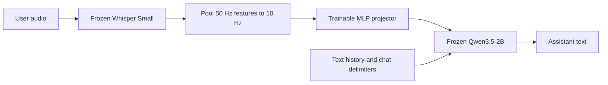
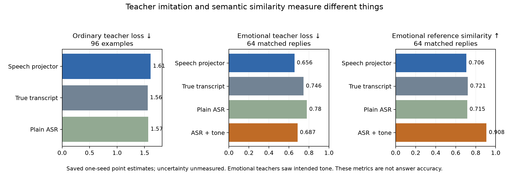
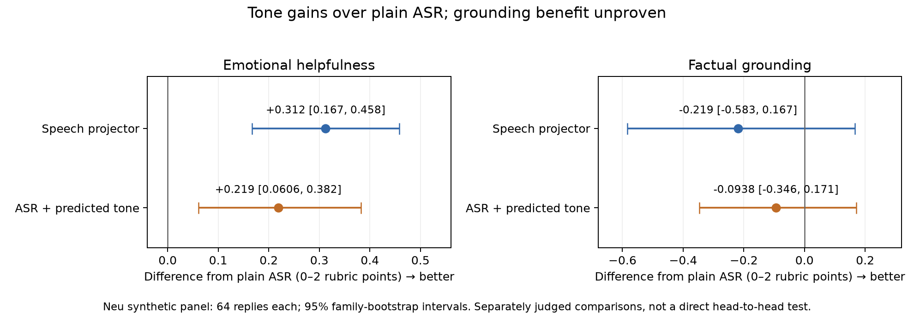

# Speech projection into a frozen language model

Can a small trainable projector turn frozen speech-encoder features into inputs
that a frozen text LLM understands? This project tests that with **Whisper Small
and Qwen3.5-2B**, including paired emotional speech and multi-turn conversations.

**In these synthetic tests, speech projection makes replies more emotionally
sensitive than plain ASR, but loses factual grounding. We did not demonstrate an
advantage over ASR plus predicted tone.** Acoustic information survives the
projector; preserving reliable conversational content remains the bottleneck.
ASR with optional acoustic tone information is the more promising practical path
from this experiment. These small experiments do not establish which architecture
is best in general.

## How it works



Projected audio vectors enter Qwen through `inputs_embeds` in the current user
message. They **do not replace its vocabulary embedding table**. Text history and
delimiters use the original embeddings; the current transcript is absent from the
speech path. Only the **2.89 million parameter** projector is trained. Gradients
pass through Qwen, whose weights remain frozen.

Training targets are Qwen's own replies to the true transcript and history.
Emotional targets additionally use intended-delivery metadata; the projector
receives only the corresponding audio. Frozen Whisper features are cached once.

## Main results

The selected model uses **10 speech tokens/second and 6,775 optimizer updates**.
Training has 38,193 examples. Validation selection uses 128 examples; the main
test scores 256 examples and generates 136 replies. Whole dialogues or synthetic
design families stay within one split.

| System | Ordinary response CE ↓ | Emotional response CE ↓, older / Neu | Pooled CE ↓ |
|---|---:|---:|---:|
| Previous 2.5 Hz projector, 4,775 updates | 1.63 | 0.852 / 0.742 | 1.5 |
| 10 Hz projector, 4,775 updates | 1.62 | 0.828 / 0.735 | 1.48 |
| **Selected 10 Hz projector, 6,775 updates** | **1.61** | **0.764 / 0.646** | **1.46** |
| True transcript → Qwen | 1.56 | 0.737 / 0.739 | 1.42 |
| Whisper ASR → Qwen | 1.57 | 0.777 / 0.77 | 1.44 |

CE measures imitation of saved teacher responses, **not answer accuracy**. The
teacher saw tone metadata for emotional targets, while the transcript and plain
ASR baselines did not. Lower emotional loss therefore cannot establish overall
superiority. The two 4,775-update checkpoints give the equal-budget compression
comparison; the selected checkpoint also received more training.



The emotional plot uses the same 64 reply IDs for every system. The projector
has slightly lower teacher loss than ASR plus tone (**0.656 versus 0.687**), but
lower reference similarity (**0.706 versus 0.908**). These measures disagree;
neither is a direct measure of correctness or emotional appropriateness.

- **Ordinary grounding:** review of 48 speech/ASR response pairs preferred ASR in
  12, speech in two, tied 32, and left two ambiguous.
- **Acoustic conditioning:** the selected projector preferred matching over
  swapped emotional audio/target assignments in 35 of 40 same-text pairs
  (**87.5%, confidence interval approximately 74–98%**). A length-controlled
  ablation retained the benefit. This is not natural emotion-recognition accuracy.
- **Longer training:** one complete pass is 4,775 updates at effective batch eight.
  Continuing to 9,550 lowered loss, but introduced three new material validation
  errors versus one correction. We retained 6,775. Convergence was not established.
- **Other objectives:** a transcript-reconstruction mixture did not beat response
  training; teacher-distribution KL failed the ordinary-loss selection safeguard.

### Emotional response quality

Reviewers scored tone helpfulness and factual grounding separately on **0–2
rubrics**. Differences below are rubric points, not percentages. Intervals are
95% family-bootstrap intervals; reviewers were models, not a human listening
panel.

| Comparison against plain ASR | Replies | Tone difference | Grounding difference | Tone wins / ties / losses |
|---|---:|---:|---:|---:|
| Selected speech projector | 88 | +0.25 [0.128, 0.36] | −0.284 [−0.609, 0.054] | 28 / 53 / 7 |
| ASR + predicted tone | 64 | +0.219 [0.061, 0.382] | −0.094 [−0.346, 0.171] | 20 / 38 / 6 |

Both show a synthetic tone benefit. Grounding preservation remains unproven, and
an independent reviewer on a smaller shared panel was less certain. The panels
differ, so these rows do not rank the two systems directly. The tone classifier
was tested on one synthetic voice and four intended deliveries; its perfect
synthetic test score does not make it a general emotion detector.



On the Neu-only panel, the projector's estimated tone gain is **+0.312** versus
**+0.219** for ASR plus tone. Both comparisons contain 64 replies, but were judged
separately against plain ASR. That nominal gap is **not a demonstrated
head-to-head improvement**. The smaller second-reviewer audit was also uncertain.

### Multi-turn behavior

Six diagnostic conversations test concrete actions, explicit endings and later
use of an initial emotional cue. The selected speech model produced **no useful
next step in any of the six cases** across the tested history formats. ASR
produced useful next steps in two fixed-history cases and four own-history
rollouts. Using previous text history recovered explicit closure in four speech
cases, but useful delayed emotional memory was not demonstrated. This small
panel establishes a failure worth fixing, not a broad dialogue success rate.

## Data and reusable generation pipeline

The mixed training set contains 19,999 DeepDialogue-derived ordinary examples,
9,094 older Qwen emotional examples, and 9,100 Neu emotional examples. The two
complete emotional source collections each contain **5,000 unique utterances,
two deliveries each, and tone-conditioned teacher replies**. Their original
audio is preserved; split and filtering details are in the full report.

The generation pipeline uses diverse everyday situations, identical words across
each pair, only plausible contrasting deliveries, and resumable text/audio
generation with hash and completion checks. Intended emotions are synthetic
control labels, not human-verified perceptual annotations.

See [dataset generation and release](docs/dataset_release.md) for the scripts,
export format, limitations and source terms.
The emotional collections should be released separately from the
DeepDialogue-derived data. Public Hugging Face uploads are in progress for
[Neu paired emotional speech](https://huggingface.co/datasets/BertilBraun/neu-paired-emotional-speech)
and [Qwen paired emotional speech](https://huggingface.co/datasets/BertilBraun/qwen-paired-emotional-speech).

## Reproduction and documentation

The reference implementation uses PyTorch/Transformers on one RTX 3090, BF16,
microbatch one, gradient accumulation eight, and activation checkpointing.
The follow-up took **5.55 hours** including evaluation and reporting; its new
training loops took **3.78 hours**. Cached features occupy **20.8 GB**. Observed
NVIDIA process memory reached **23.8 GB**, a sampled observation rather than a
measured peak. The selected projector checkpoint is **11.6 MB**.

```powershell
uv sync
uv run ruff format
uv run ruff check --fix
uv run pytest -m "not integration"
```

- [Full experiment report](docs/experiment_report.md): training decisions,
  uncertainty, qualitative examples, plots and resource accounting.
- [Results index](results/followup_20261007/README.md): saved measurements,
  complete response reviews and selection receipts.
- [Model and scheduler interface](docs/rust_scheduler_model_handoff.md): audio,
  exact chat delimiters, prefill and cache handling.
- [Dataset generation and release](docs/dataset_release.md).
- [Manual publication guide](docs/publication.md).

Measurements in documentation use three significant digits. Exact counts,
configuration values, token IDs, hashes and original machine-readable evidence
are retained for reproduction. Earlier V0–V3 experiments used different
supervision and remain historical; the teacher-supervised results above are the
current findings. No LoRA or speech-encoder fine-tuning was performed.

Both complete emotional collections preserve their original audio and teacher
targets. The README plots can be regenerated from the locked reports:

```powershell
uv run python -m scripts.plot_readme_results --analysis .\results\followup_20261007\analysis --output .\docs\figures
```
